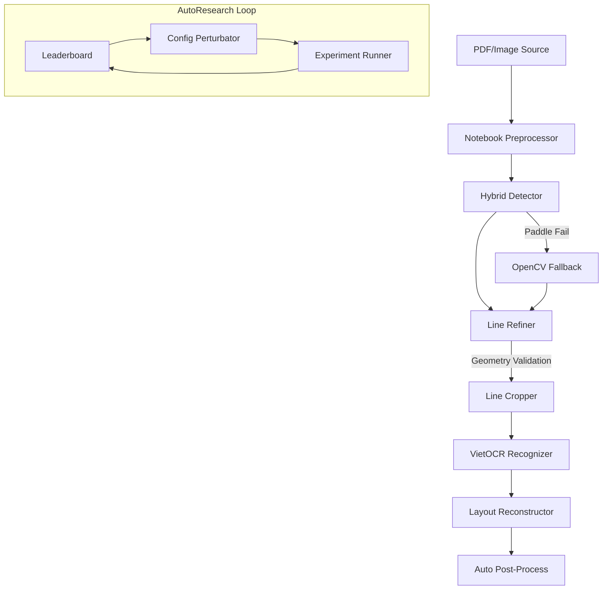

# Vietnamese Handwritten OCR with AutoResearch (Phase 2B)

[](https://github.com/khanghoang123/ocr_ai_agent_coding)
[](experiments/leaderboard/leaderboard.csv)
[](REPORT.md)

Dự án này tập trung vào việc xây dựng một hệ thống OCR (Nhận diện ký tự quang học) mạnh mẽ cho tiếng Việt viết tay, sử dụng quy trình nghiên cứu tự động (AutoResearch) để tối ưu hóa các tham số hình học và tiền xử lý.

## 🚀 Điểm nổi bật (Phase 2B)

Hệ thống đã chuyển từ một pipeline tĩnh sang một quy trình **Auto-Loop** có khả năng tự thử nghiệm và đánh giá:

1.  **AutoResearch Engine**: Tự động tạo giả thuyết (perturbation), chạy thực nghiệm và cập nhật Leaderboard để tìm ra bộ cấu hình (`crop_padding`, `upscale`, `rectify_line`) tối ưu nhất.
2.  **Geometry-Aware Refinement**:
    *   **Deskew & Rectification**: Tự động căn chỉnh độ nghiêng và làm phẳng các dòng chữ bị cong.
    *   **Validated Geometry**: Ràng buộc biên của dòng chữ dựa trên các dòng lân cận để tránh chồng lấn văn bản.
    *   **Split Recovery**: Tự động phát hiện và tách các dòng bị dính (merged lines) dựa trên mật độ ink-occupancy và projection.
3.  **Hybrid Detector**: Sử dụng PaddleOCR với cơ chế **OpenCV Row Projection Fallback** cực kỳ ổn định khi môi trường runtime gặp lỗi.

## 🔬 Chiến lược Dữ liệu & Phân tích Thực nghiệm

Ý tưởng chính của dự án là chứng minh việc **bổ sung dữ liệu bằng Pseudo-labeling** (kết hợp lọc tự động và sử dụng LLM như Gemini Flash để gán nhãn) giúp mô hình đạt hiệu suất tốt hơn trong điều kiện dữ liệu Ground Truth (GT) hạn chế.

### 📊 So sánh 10k vs 50k Iterations

| Cấu hình | Iterations | Test CER | Test EM | Nhận xét |
|:---|:---:|:---:|:---:|:---|
| Baseline (13k GT) | 10k | 4.38% | 32.50% | Hội tụ chậm hơn ở giai đoạn đầu. |
| **Exp B (13k GT + 2.5k Pseudo)** | **10k** | **4.23%** | **32.80%** | **Thắng ở giai đoạn đầu** nhờ lượng dữ liệu lớn. |
| **Baseline (13k GT)** | **50k** | **2.73%** | **50.46%** | **Thắng ở giai đoạn cuối** do bias vào tập GT. |
| Exp B (13k GT + 2.5k Pseudo) | 50k | 2.98% | 46.55% | Bị nhiễu nhẹ từ pseudo-labels khi train quá lâu. |

### 💡 Phân tích & Giải thuyết
*   **Hiệu quả ban đầu**: Ở 10k iterations, Experiment B vượt trội nhờ có thêm 2,500 mẫu pseudo-labels chất lượng cao, giúp mô hình học được nhiều pattern hơn trong thời gian ngắn.
*   **Hiện tượng Bias/Distribution Alignment**: Vì tập **Test** được chia trực tiếp từ tập dữ liệu **Ground Truth**, nên khi huấn luyện lâu (50k iterations), mô hình Baseline (chỉ học GT) có xu hướng "fit" hoàn hảo vào phân phối của GT. 
*   **Tác động của Pseudo-labels**: Dữ liệu pseudo-labels (dù đã được lọc) vẫn là nhãn "silver" (do AI gán). Khi train quá sâu, những sai số nhỏ hoặc sự khác biệt về phong cách gán nhãn giữa LLM và con người có thể tạo ra rào cản, khiến mô hình không thể đạt tới độ chính xác tuyệt đối như khi chỉ dùng dữ liệu "gold" GT trên chính tập test của nó.

### 🚀 Hướng cải tiến tương lai
*   **Nâng cấp Labeling**: Sử dụng các LLM mạnh hơn (Gemini 1.5 Pro, GPT-4o) để gán nhãn chính xác hơn cho các trường hợp chữ khó.
*   **Advanced Filtering**: Áp dụng cơ chế **Confidence-based Filtering** (lọc dựa trên độ tin cậy của model) kết hợp với **Cross-Consistency Check** giữa nhiều model OCR khác nhau.
*   **Domain Adaptation**: Thu thập thêm dữ liệu thực tế ngoài tập GT hiện tại để kiểm chứng khả năng tổng quát hóa (generalization) thực sự của Pseudo-labeling thay vì chỉ đánh giá trên tập test bị bias.
*   **Active Learning**: Tự động phát hiện các mẫu mà model chưa tự tin để ưu tiên gán nhãn bằng con người hoặc LLM cấp cao.

## 🛠️ Kiến trúc hệ thống



## 📂 Cấu trúc thư mục

*   `src/ocr_pipeline/`: Mã nguồn cốt lõi của pipeline (Detector, Refiner, Cropper).
*   `configs/`: Chứa các file cấu hình YAML cho từng phiên bản thực nghiệm.
*   `experiments/`:
    *   `runs/`: Lưu trữ kết quả của từng lượt chạy (Crops, Metrics, Logs).
    *   `leaderboard/`: Bảng xếp hạng các cấu hình tốt nhất.
*   `scripts/`: Các script chạy thực nghiệm và AutoResearch.

## ⚙️ Hướng dẫn cài đặt & Sử dụng

### 1. Cài đặt môi trường
```bash
conda create -n ocr_agent python=3.10
conda activate ocr_agent
pip install -r requirements.txt
```

### 2. Chạy thực nghiệm cơ bản
```bash
python scripts/run_ocr_experiment.py --config configs/baseline.yaml --dataset data/processed/val.txt --output-dir experiments/runs/baseline
```

### 3. Kích hoạt AutoResearch
```bash
python scripts/auto_research.py --dataset data/processed/val.txt --iterations 5 --limit 10
```

## 📝 Roadmap & Tiếp theo
- [x] Triển khai Geometry-Aware Refinement (Phase 2A).
- [x] Tích hợp AutoResearch Loop (Phase 2B).
- [ ] Hoàn thiện Document Perspective Correction (Phase 3).
- [ ] Tối ưu hóa tốc độ inference bằng ONNX/TensorRT.

---
*Dự án được bảo trì bởi @khanghoang123.*
